<!-- _class: lead -->
<!-- _paginate: false -->
<!-- _header: '' -->
<!-- _footer: '15 mrt 2024' -->

# Digital Gardening 101

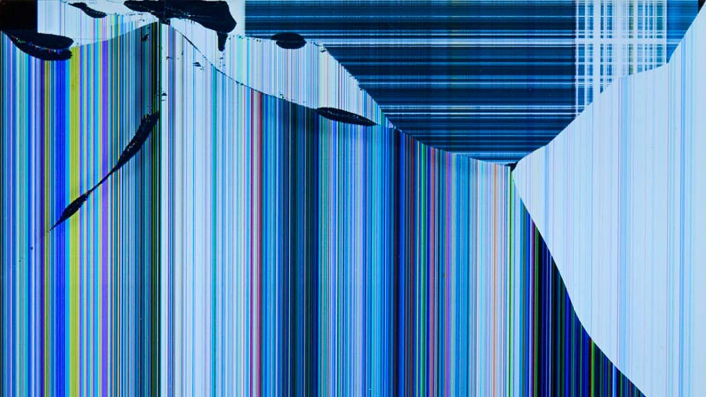

Own your web, or it will own you...

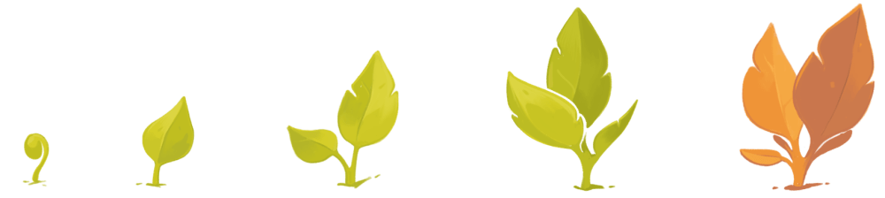

---

<!-- _class: invert -->

## Vandaag

- I really love the web...
- Digital Gardening
- Begin met tuinieren
- Indieweb

---

<!-- _class: lead -->
<!-- _class: invert -->

## I really love the web...

...maar het voelt anders tegenwoordig... het was vroeger zo'n magische plaats.

---

### Hoe het voor mij begon

In 1987 - toen was ik negen - had ik vooral interesse in Lego en de treinbaan met bijkomstige soldeerprojecten en electronica van mijn buurjongen.

Af en toe nam een oom een portable computer mee van zijn werk en die waren heel interessant. Toen kocht mijn vader een _state of the art_ NCR 3390-1306 Workstation.

---

### Opstarten met een prompt

Het operating systeem wat met deze machines kwam was NCR-DOS, een MS-DOS variant. Hier zie je het opstartscherm van dit OS.

Als je iets wilde doen op een personal computer dan begon het met een prompt. Ik speelde spelletjes en ik ontdekte al gauw dat `AUTOEXEC.BAT` aanpasbaar was.

---

### Computer games

Een van de games die mij bij staat is Aldo (1987). Je startte het op door een floppy in de drive te stoppen en vervolgens `a:\` en daarna `aldo.exe` in te typen.

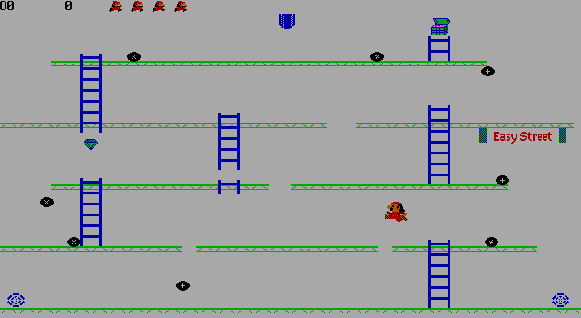

---

### Word perfect

Er zat ook een tekstverwerker op, WordPerfect, die startte je op met `wp51.exe`. Met `F1` kwam er een _onderwater scherm_ waarop je de structuur van een document zag.

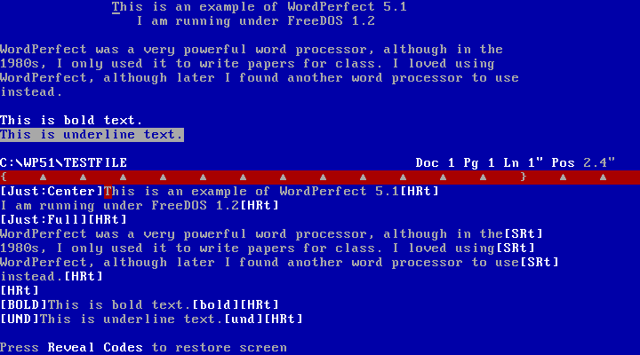

---

### Commodore 64

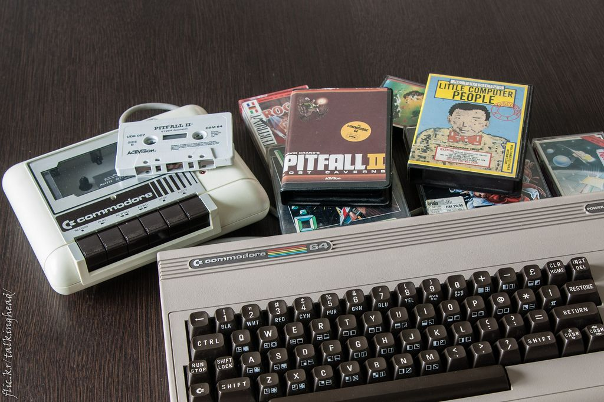

In 1990 kreeg een vriend van me een C64 met Turrican, een enorm coole superverslavende platformgame.

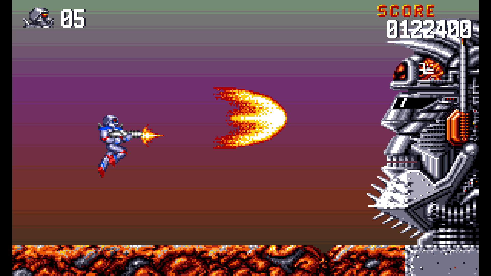

---

### Commodore 64

De C64 had een casseterecorder als data-opslag medium. Er waren radioprogramma's die software uitzonden en die kon je opnemen.

Ik had helemaal niets aan alle DOS batch-script kennis want de C64 gebruikte BASIC, tijd om iets nieuws te leren dus...

---

### MS-DOS Editor

Ik ontdekte dat MS-DOS een variant, GW-BASIC ondersteunde en vanaf dat moment was ik niet meer weg te slaan bij de computer. Hier zie je `edit`, mijn eerste GUI omgeving.

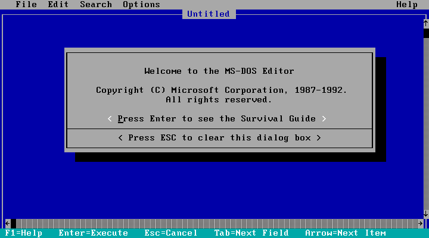
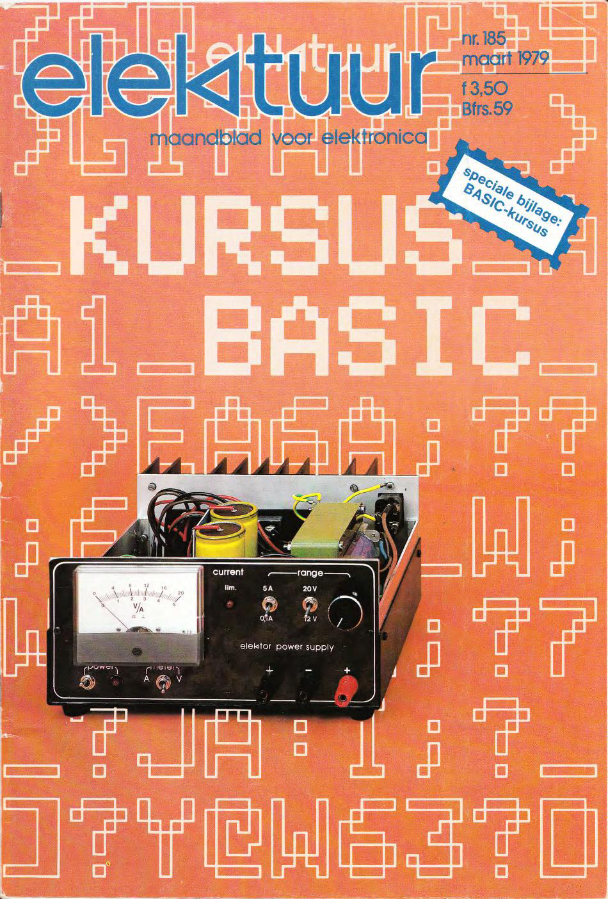

---

### 14k4 modem

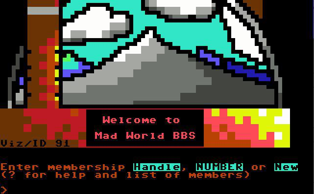

In 1992 kwam er een nieuwe, zelf samengestelde PC met een 14k4 modem. Ik kon bij vrienden inbellen en we maakten onze eigen marginale Bulletin Board Systems (BBS).

---

### Op de fiets naar de uithof

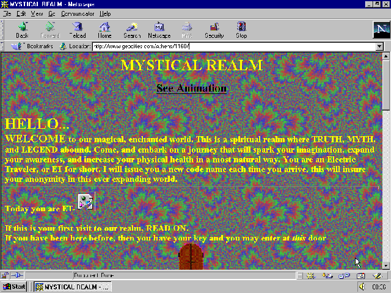

In 1994 begon een vriend aan de de Universiteit van Utrecht (UU) en liet me zijn account gebruiken...

Het netwerk op de UU was super goed en ik ging op de fiets (~20km) met een doosje floppies in mijn tas van Amersfoort naar Utrecht om dingen van USENET te downloaden, websites te bezoeken.

...meer [websites uit dit tijdperk](https://blog.geocities.institute/)?

---

### HBO ICT

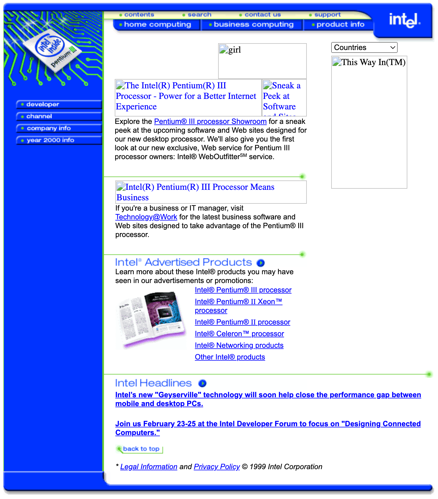

In 1998 begon ik met de studie Hogere Informatica en had direct een bijbaan als HTML-er bij EuroRSCG Interactive.

Corporate websites bestonden destijds uit honderden HTML pagina's, gemaakt op basis van tabellen met _sliced_ achtergrond afbeeldingen en gekleurde pixel _.gifjes_. Ze werden gebouwd door enorme teams en enorme kantoren.

---

### De opmars van de platformen

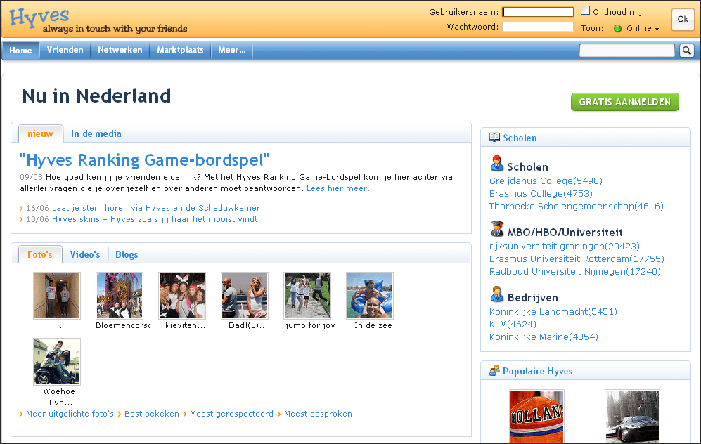

In 2004 begon Hyves in Nederland... dat is waar voor mij het authentieke _homegrown_ gevoel verloren ging...

De noodzaak technologie te omarmen verdwijnt omdat het web met een formulier op een platform in te vullen is en mensen drukken zich slechts nog uit middels tooling en op de netwerken van TikTok, LinkedIn, Twitter, insta/facebook of Medium.

---

### De opmars van de frameworks

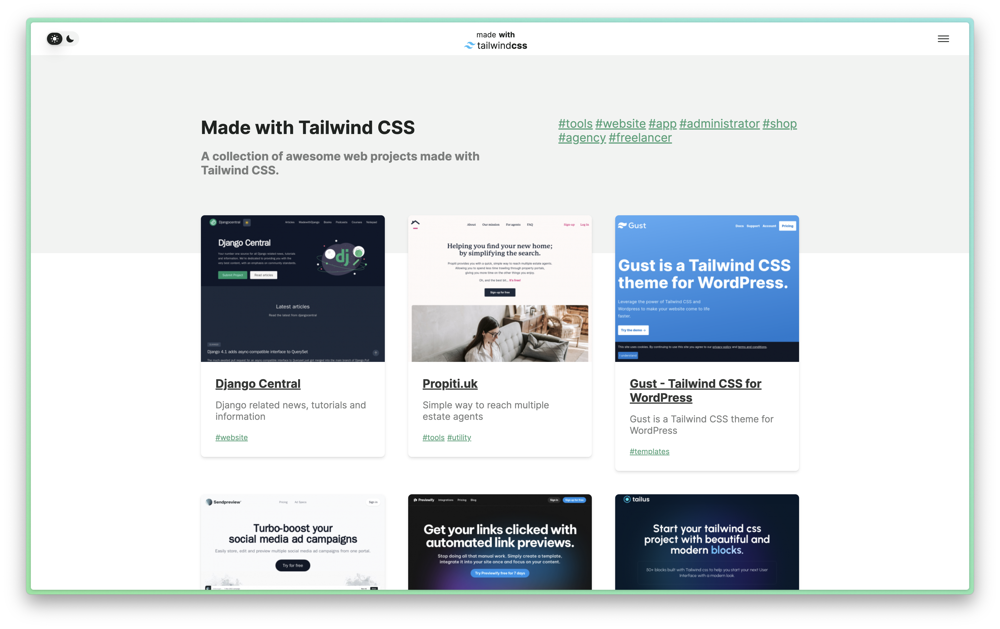

Tegelijk ontstond de tendens om libraries en frameworks te gebruiken voor het (op)maken van websites.

Dat begon met kleine, handige libraries maar groeide uit tot een monster buiten alle proporties.

Hier zie je bootstrap 2011 en tailwind 20024. Nadeel van dit soort oplossingen is dat alles er hetzelfde uit ziet. De ruwe magie van het web, het exploratieve, dat is verdwenen...

---

<!-- _class: lead -->
<!-- _class: invert -->

## Digital Gardening

De authentieke manier van het publiceren op het web. In vrije vorm, werk-in-uitvoering... Half afgeronde aantekeningen die over tijd groeien. Niet verfijnd of compleet, niet rigide, niet perfect...

---

### 1998 Hypertext Gardens

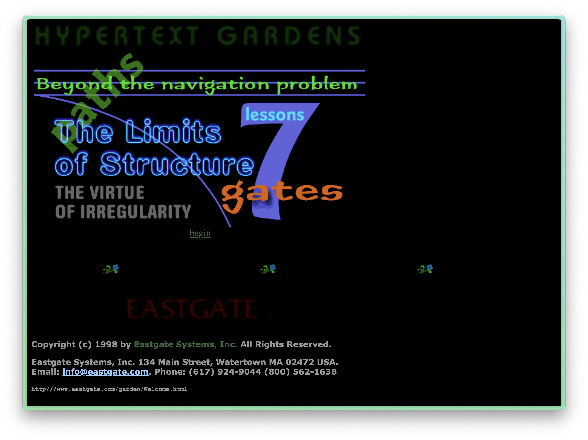

De term 'garden' in relatie tot het web is in 1998 bedacht in 1998 door Mark Bernstein. Hij doelde op de ervaring van het verkennen van het web en niet zozeer op persoonlijke websites.

[eastgate.com/garden](https://www.eastgate.com/garden/)

---

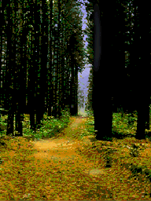

> "Unplanned hypertext sprawl is wilderness: complex and interesting, but uninviting. Interesting things await us in the thickets, but we may be reluctant to plough through the brush, subject to thorns and mosquitoes" - Mark Bernstein

---

### 2007 Digital gardening als opruimen/ snoeien/ onkruid wieden

Rory Sutherland gebruikte de term in april 2007 voor het opruimen van je digitale omgeving. Een klein clubje twitteraars ging hier in mee en gebruikte de term een tijdje maar er waren geen referenties naar de intentie uit de jaren '90.

> "Digital gardening - ie faffing about syncing things, defragging - like pruning for young people" [@rorysutherland](https://twitter.com/rorysutherland/status/34981652)

> "really need 2do some digital gardening in my iPhoto library. If u were gonna divide huge library into smaller ones, what would u name them?" [@TheMacMommy](https://twitter.com/TheMacMommy/status/40614201554640896)

---

### 2015 The Garden and The Stream

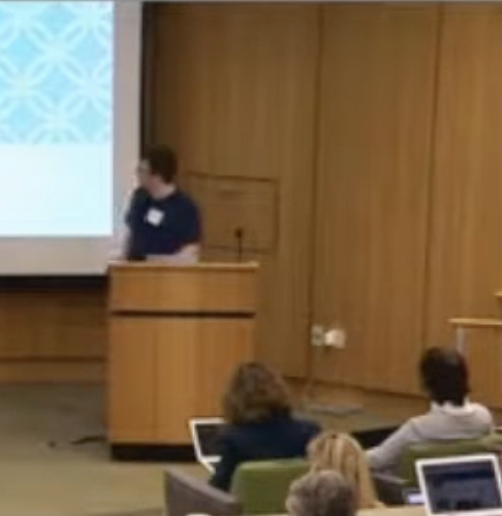

In 2015 geeft Mike Caufield een keynote waarin hij het verschil tussen een _garden_ en een _stream_ uitlegt, termen die hij als metafoor voor het web gebruikt.

[Mike Caufield - The Garden and the Stream](https://youtu.be/ckv_CjyKyZY?t=935)

---

### The Garden

> "Every walk through the garden creates new paths, new meanings. When we add things we add them in a way that allows for new things to develop, to grow. [...] To ask what happened first is a trivial question, the tree has a relationship to the bridge. The bridge will add meaning over time, even for the architect." - Mike Caufield

---

### The Stream

> "You don't experience the stream by walking around it. You get in the stream and the stream flows past you. [...] The stream presents us with a time ordered path. [...] To understand a statement you need to recapitulate instead of iterate." - Mike Caufield

---

### Het web voelt anders

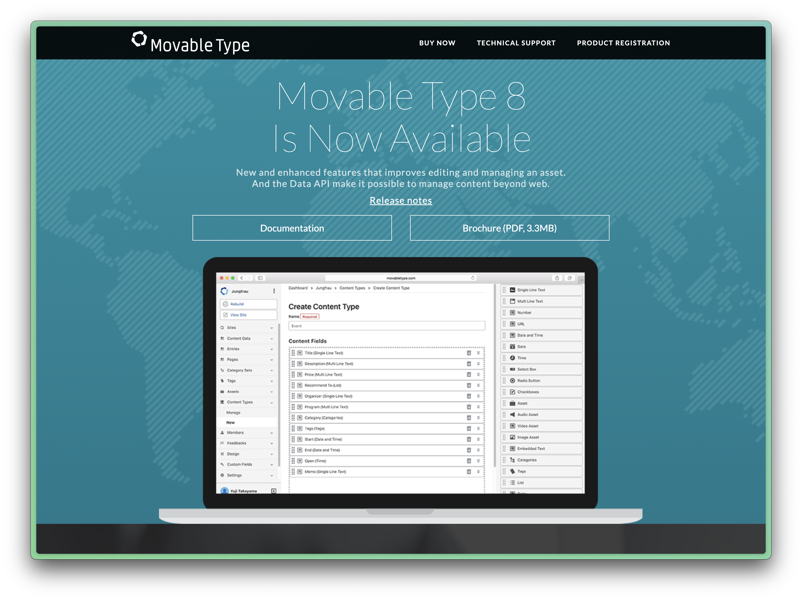

De overgang naar de _stream_ verloopt heel geleidelijk. Rond 2018 schrijven een aantal mensen over deze andere ervaring en zoeken het moment dat er iets veranderde.

> "Suddenly people weren’t creating homepages or even web pages... they were writing web content in form fields and text areas inside a web page" - [Amy Hoy](https://stackingthebricks.com/how-blogs-broke-the-web/)

---

### Wat de 'stream' met je doet

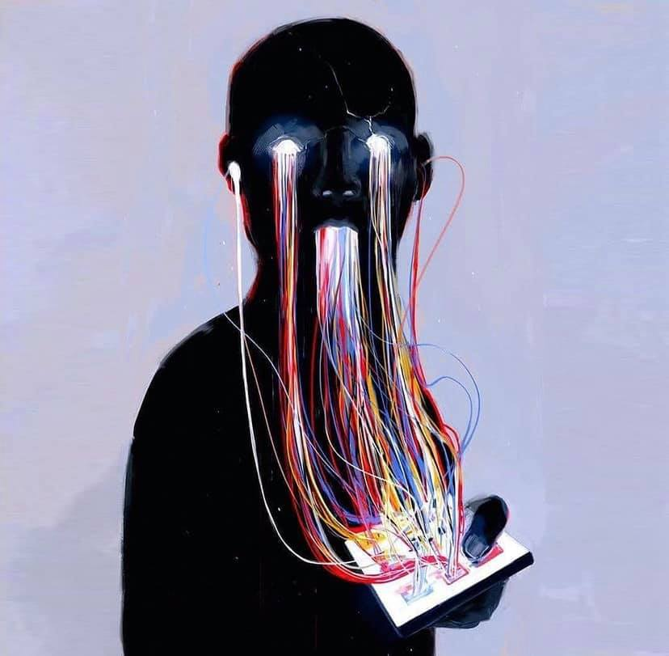

De stream wordt gevuld met _statements_ van mensen die algoritmisch gesorteerd weer teruggevoerd worden aan mensen.

Het is dermate verslavend gemaakt dat je uren blijft scrollen, verloren tijd die je vrijwillig afstaat aan een algoritme dat gericht is op het genereren van reclame-inkomsten.

---

### Wat de 'stream' met je doet

Het web dat jij waarneemt zie je steeds meer door het algoritmisch filter van Elon, Mark, Jeff, Larry en Sergey. Welke agenda hebben zij? Hebben ze het beste met je voor?

Nope.. ze dwingen je jezelf en jouw ideeen uit te drukken binnen hun sjabloon. Daarbovenop tracken ze je kapot om je geboeid te houden en jouw data te verkopen... en als ze je zat zijn?

---

<!-- _class: lead -->
<!-- _class: invert -->

## Begin met tuinieren

Jullie hebben als geen ander de mogelijkheid om de zes patronen van _digital gardening_ te omarmen en jouw eigen plekje op het web te cultiveren...

1. omdat je de principes van het web beheerst
2. omdat je het al gewend bent in je wiki

---

### Zes patronen voor succesvol _digital gardening_:

1. Topografie boven tijdlijnen
2. Continue groei
3. Imperfectie en publiek leren
4. Speels, persoonlijk en experimenteel
5. Samengaan van diverse inhoud
6. Onafhankelijk eigenaarschap

Bron: [Maggie Appleton](https://maggieappleton.com/garden-history)

---

### 1. Topografie boven tijdlijnen

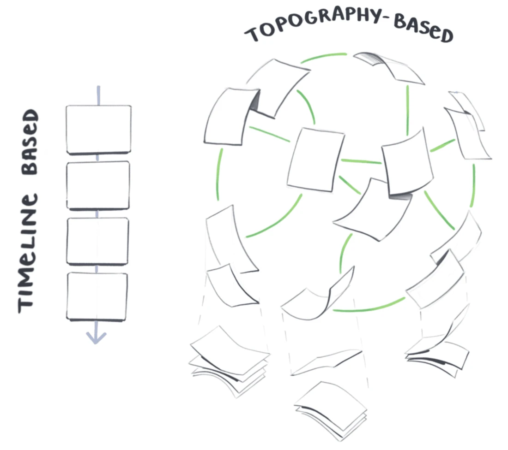

Als concepten en thema's op jouw site geleidelijk mogen groeien, en zich tot andere elementen verhouden, dan zijn publicatiedata totaal onbelangrijk.

Dit is tegengesteld aan de structuur van traditionele blogs. De beste manier om dit te bereiken zijn bi-directionele links. Dit maakt het voor gebruikers gemakkelijk

---

### 2. Continue groei

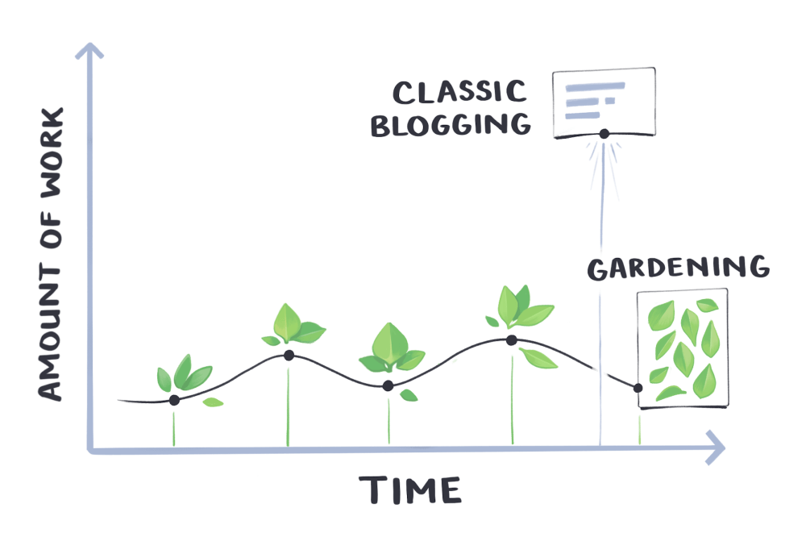

Een tuin is nooit af maar verandert doorlopend, elk seizoen levert weer nieuwe verassingen en uitdagingen. Het kost tijd en liefde om een tuin te cultiveren. Onkruid wieden, een plantje erbij, snoeiwerk.

Een digitale tuin groeit met je mee, je gedachten en inzichten veranderen met de tijd en daarmee pas je verzamelde _artefacten_ aan.

---

### 3. Imperfectie en publiek leren

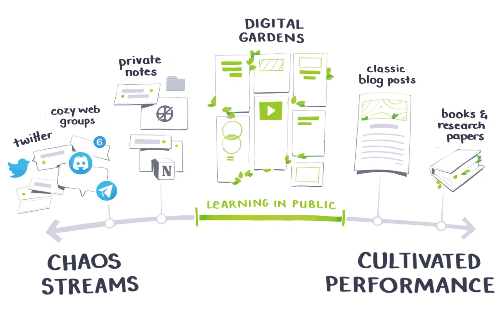

Digitale tuinen zijn imperfect ontworpen. De ruwe randjes worden niet verborgen. Het voelt misschien raar om iets half-af op het web te gooien. Dit komt doordat we getraind zijn om als _brands_ door het digitale leven te gaan.

Tuintjes zijn _weird_ en balanceren tussen _chaos stromen_ en _gecultiveerde voordracht_.

---

### 4. Speels, persoonlijk en experimenteel

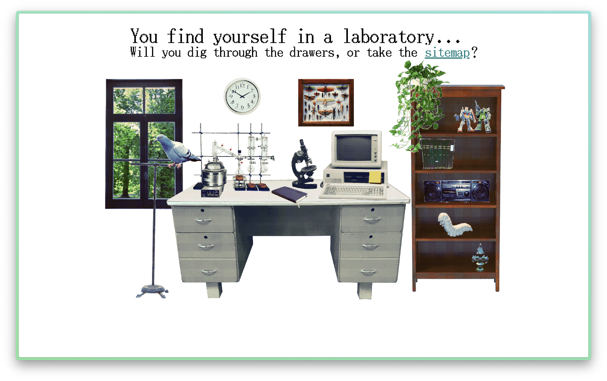
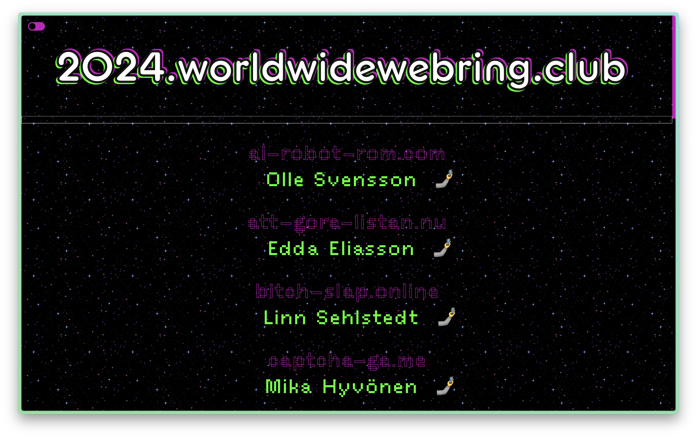

Een digitale tuin is net zo uniek en bijzonder als een echte tuin. Het doel is een persoonlijke digitale speelplaats te creeeren.

Je organiseert de tuin rond de ideeen en media die jouw manier van denken tonen in plaats van je uit te drukken in een vast sjabloon.

[ribo.zone](https://ribo.zone/)
[2024.worldwidewebring.club](https://2024.worldwidewebring.club/)

---

### 5. Samengaan van grote diversiteit inhoud

Een digitale tuin is niet slechts een verzameling woorden. Alles wat je aan media verzameld kan een plekje krijgen om te groeien.

Denk aan: Podcasts, video, diagrammen, illustraties, interactieve animaties, academische papers, sketchnotes, tweets, ruwe schetsen, haikus, stukjes code, experimenten...

---

### 6. Onafhankelijk eigenaarschap

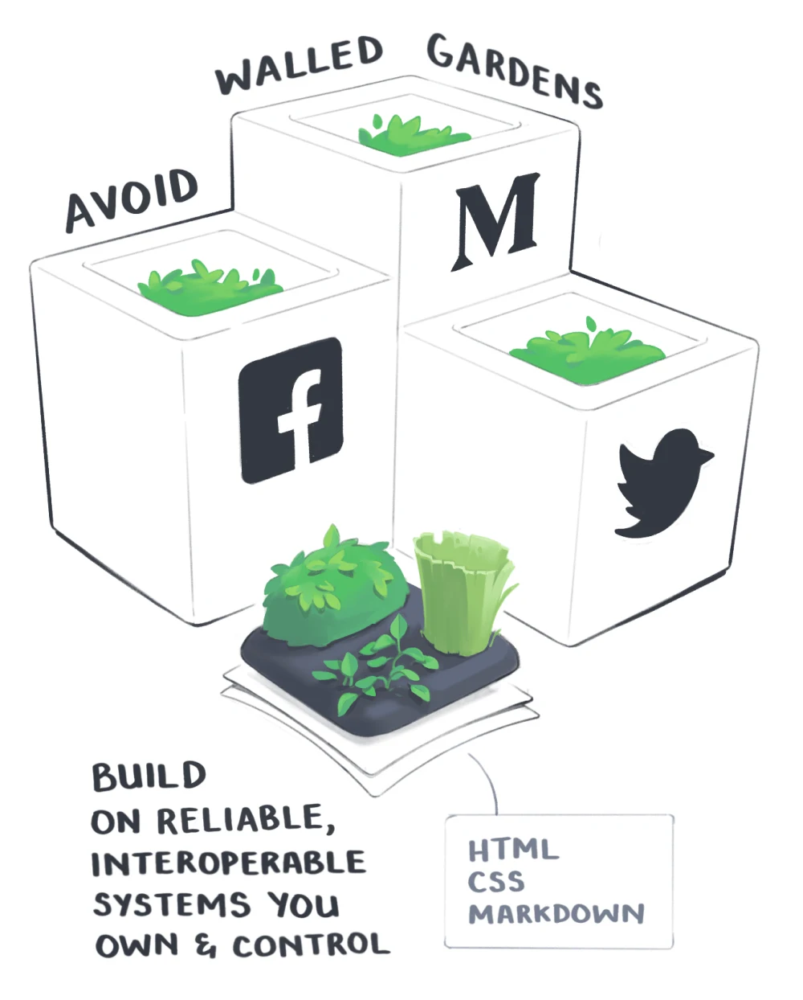

Een digitale tuin gaat over het claimen van jouw plaats op het web. Die plaats is niet op de servers van Facebook, LinkedIn, Twitter, Instagram/Facebook of Medium.

Als deze services ten onder gaan nemen ze jouw data en al je creaties met zich mee. Zorg dat je eigenaar blijft van jouw eigen data.

---

<!-- _class: lead -->
<!-- _class: invert -->

## Het indieweb

...een beweging die streeft naar een onafhankelijk world-wide-web waarin échte mensen links leggen naar échte ideeën, op unieke wijze.

---

### Hoe wordt je dan gevonden?

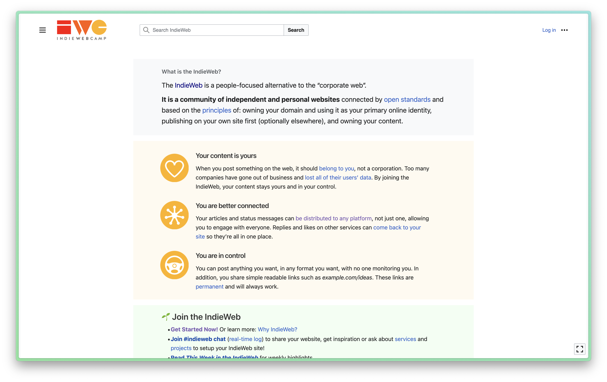
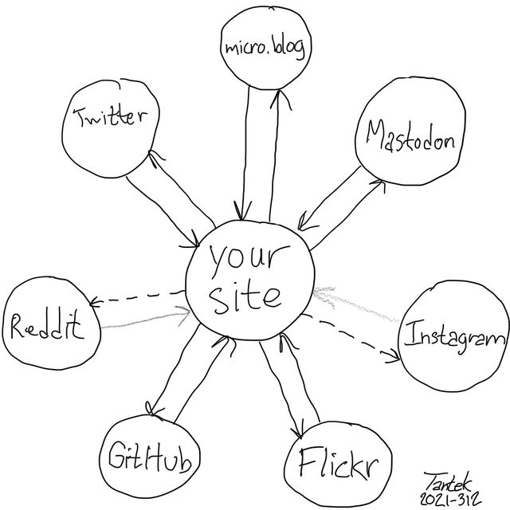

Indieweb geeft benaderingen voor waarmee jouw website in het hedendaagse ecosysteem kan bestaan. Bijvoorbeeld door API's aan te spreken (of RSS te gebruiken):

- **COPE**: Create Once, Publish Everywhere
- **PESOS**: Publish Elsewhere, Syndicate (to your) Own Site
- **POSSE**: Publish (on your) Own Site, Syndicate Elsewhere

---

### How-to indieweb?

1. Registreer een eigen domeinnaam
2. Maak een eigen site en zet die online...

... dat kan op [veel manieren](https://indiewebify.me/). Uitgangspunt is dat je eigenaar van je data blijft:

- **basic** op GitHub / GitLab, jullie weten hoe maar delete je lokale source niet (gratis)
- **hosting provider** voor huren van shared/ private hosting of een vhost (abonnement)
- **self-hosted** op een pc of nerdy met een [Raspberry-PI](https://pimylifeup.com/raspberry-pi-web-server/) in je meterkast (443 forward)
- **self-hosted** godmode op een [solar-powered Raspberry-PI](https://solar.lowtechmagazine.com/) (gear setup)

---

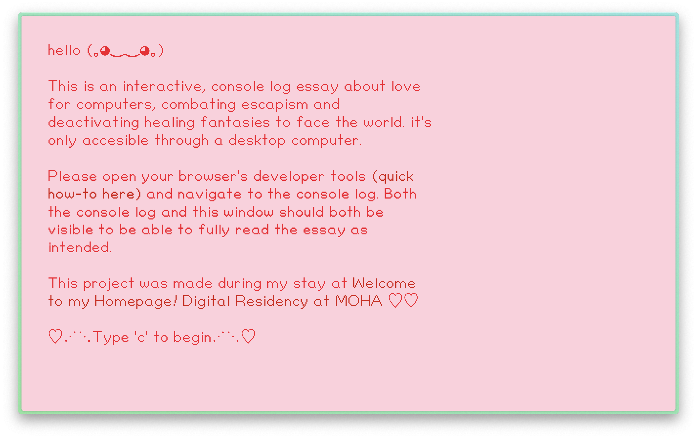
[all-about-computer-love.glitch.me](https://all-about-computer-love.glitch.me/)

---

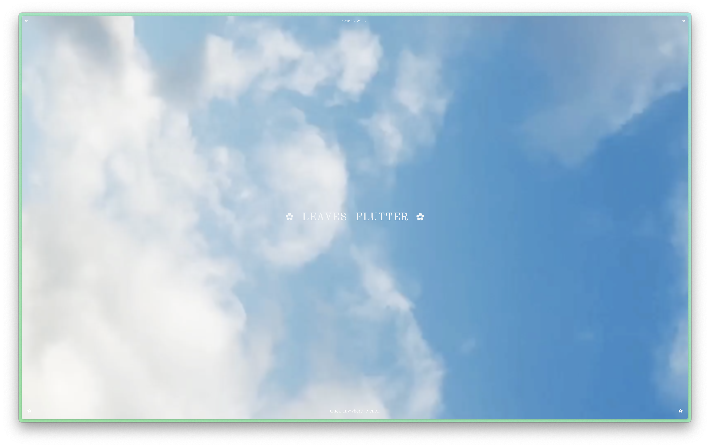
[ambient.institute](https://ambient.institute/)

---

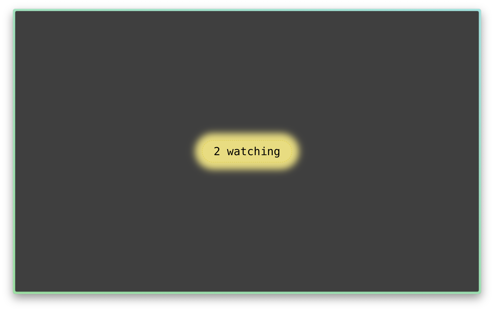
[cursorwatch.ing](https://cursorwatch.ing/cursors)

---

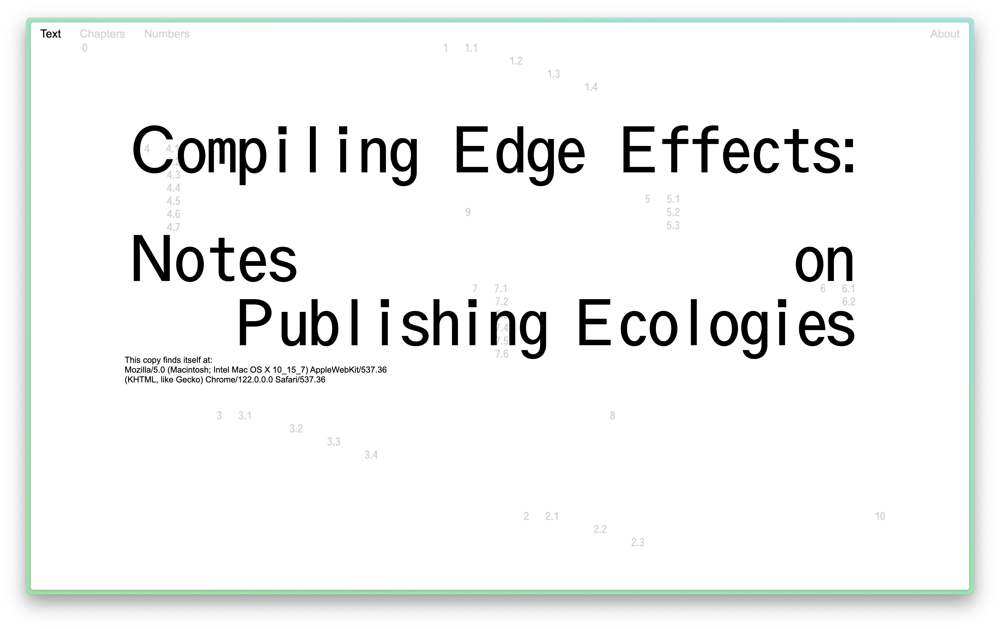
[ecologies.online](https://ecologies.online/)

---

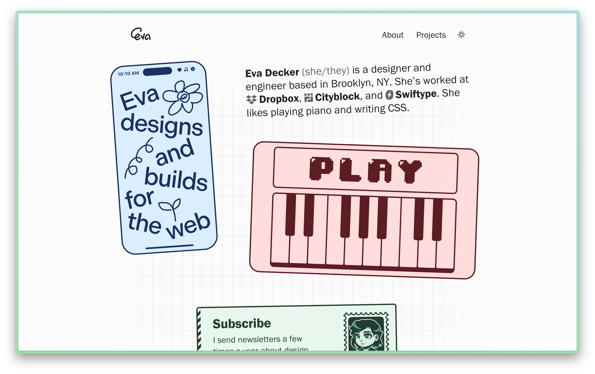
[eva.town](https://eva.town/)

---

[o-p-h-e-l-i-a-you.live](http://o-p-h-e-l-i-a-you.live/)

---

[connie.surg](https://www.connie.surf/)

---

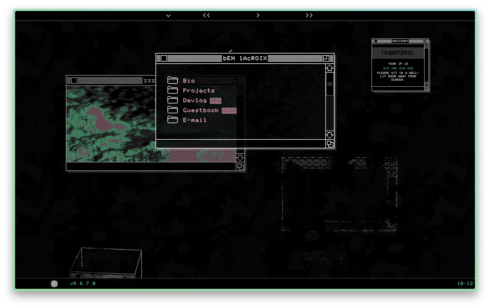
[benlacroix.com](https://benlacroix.com/)

---

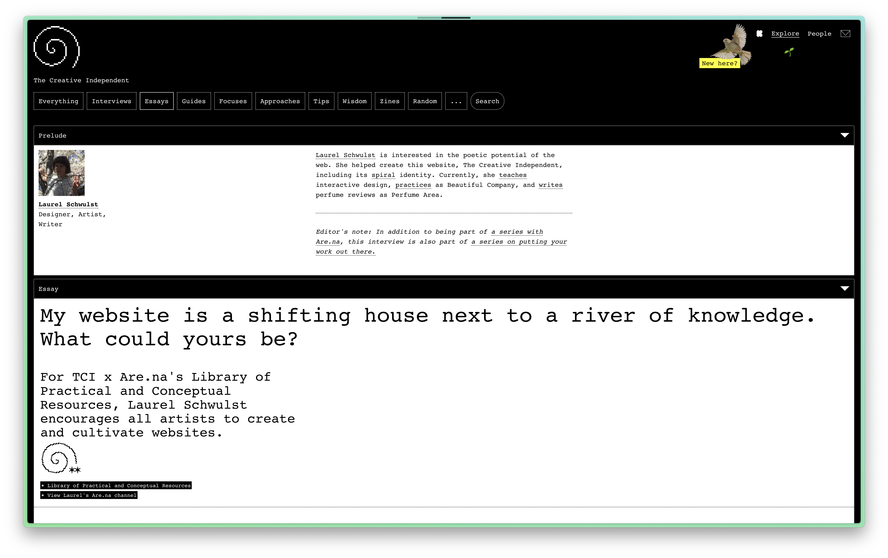
[thecreativeindependent.com](https://thecreativeindependent.com/essays/laurel-schwulst-my-website-is-a-shifting-house-next-to-a-river-of-knowledge-what-could-yours-be/)

---

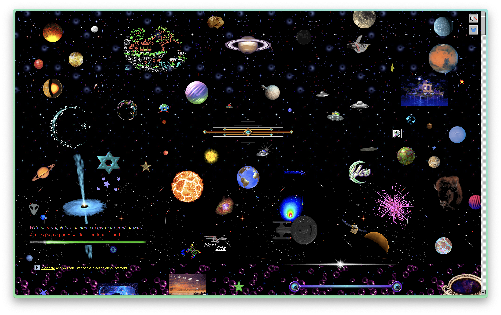
[cameronsworld.net](https://www.cameronsworld.net/)

---

## Get your handmade web fix!

[Gossip’s Web](https://gossipsweb.net/) - een verzameling van handgemaakte websites
[TheHTML.review](https://thehtml.review/) - een literair / kunst magazine voor websites
[Naive Weekly](https://www.naiveweekly.com/) - nieuwsbrief vol kleine, poetische websites
[Taper](https://taper.badquar.to/) - een magazine voor kleine computationele stukken
[The useless web](https://theuselessweb.com/) - excentrieke websites met eenvoudige interacties

---

<!-- _header: '' -->

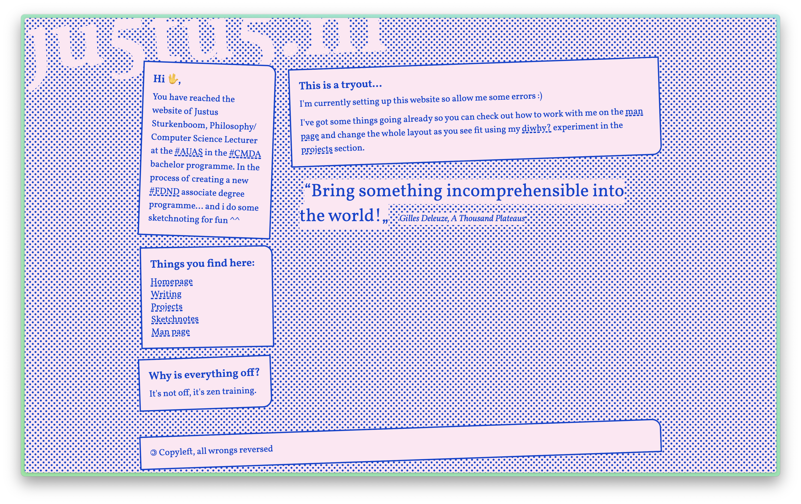
